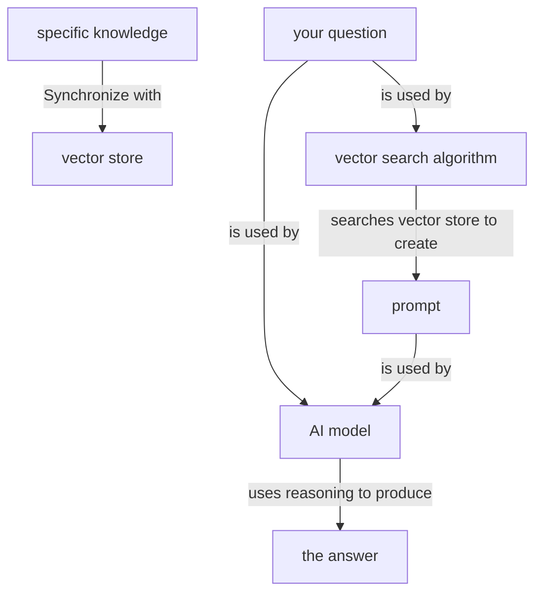
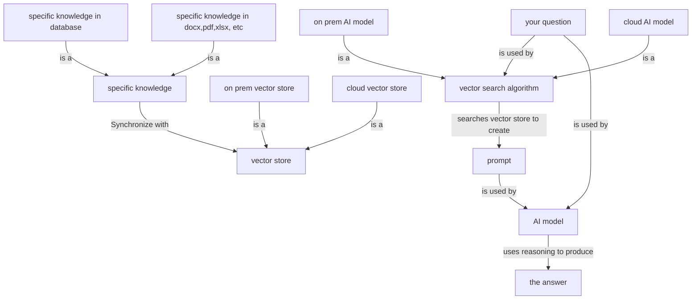
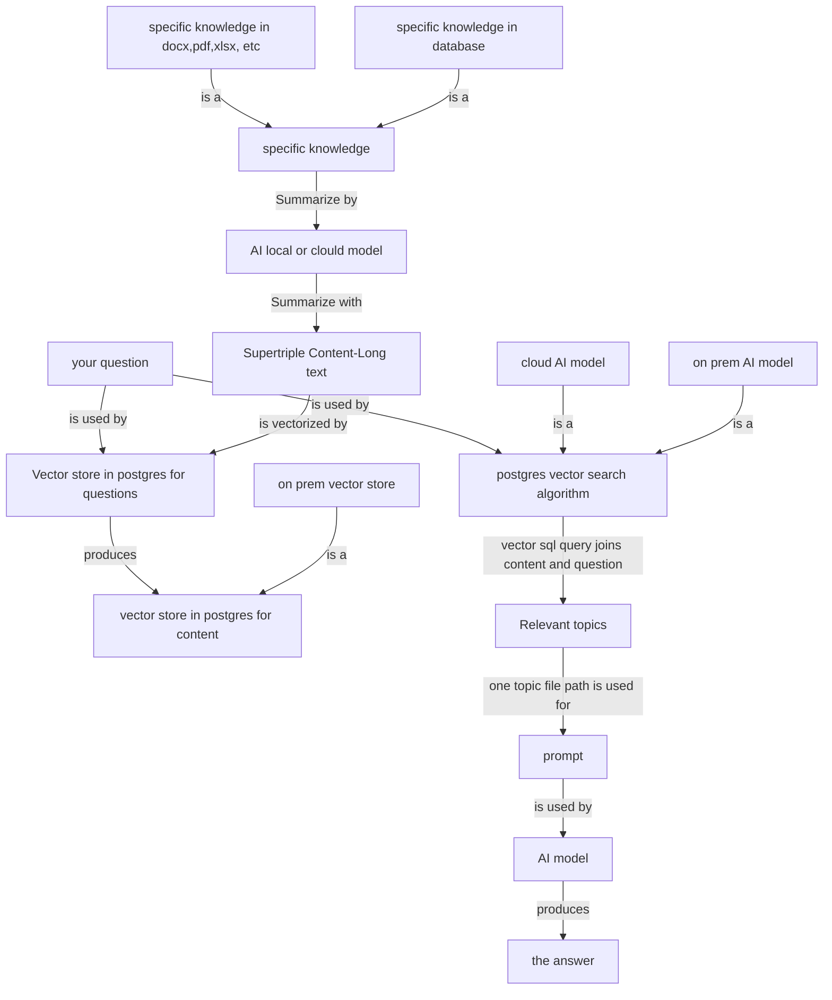

# special-purpose-ai

special-purpose-ai  

## Overview  

Problem: All AI Models are designed to store your questions and prompts as part of the learning process. That means your information will not be private, it will be part of global knowledge, and it can be given to other users. This is a problem for the Government or Finance or Medical industry, since it is very difficult to hide/mask personal information during interaction with AI. Also, it is very difficult to force the hosted AI model to use specific information from your organization to answer the question.  AI will hallucinate and may not provide focused answers.  
  
Solution: Special purpose private AI model can use your organization's knowledge to answer your question. Store your organization information in vector store. Then, use the vector store to create prompt that can be sent to local AI model or cloud AI model along with a question.  
  
DataJoin.net provides in-depth education and consultation on special purpose AI model.  
  
milan@datajoin.net  
http://datajoin.net  
https://github.com/milan888-design/special-purpose-ai  
  
## Flowchart- Special purpose AI  

  
## Flowchart- Special purpose AI details  

  
## Flowchart- Special purpose AI details  version 2. 

  
tables in postgres  
document_embeddings_content row_id and embedding of long_text field of supertriple  
document_embeddings_question row_id and embedding of question by end user on text box on UI  
document_embeddings_title not used currently, but, it can be the vector of supertriple object_value field. This would be same as document_embeddings_content     
document_question row_id and question in text 
  

test_llam_ollam_prompt_rowid.py  this should be developed using the program below.  
This is not yet developeds  
  
test_llam_ollam_prompt_batchid.py  
This is new program for multiple record to be processed to create summary from pdf, word or txt file.  

There are three function one each of pdf, docx and txt
def extract_text_from_pdf(pdf_path: str) -> str:  
   
def extract_text_from_docx(docx_path: str) -> str:  
  
def extract_text_from_txt(txt_path: str) -> str:  

Two separate functions one for local ollama and one for openai to get the content summaries  
def send_prompt_to_ollama(prompt_content: str, model: str, api_url: str) -> str:  
  
def send_prompt_to_openai(prompt_content: str, model: str, api_key: str) -> str:  

Get the rows from simpletable for processing
if __name__ == "__main__":  
    arg2_MODEL_NAME = sys.argv[1]  
    arg6_batch_id = sys.argv[2]  
the following change is needed to use the same program for one row_id4
    arg7_row_batch = sys.argv[3]  

if arg7_row_batch=="batch_id":
    sqlpart1="select row_id,spo_prompt1,spo_prompt1_detail from st_supertriple_v2 where batch_id='"  
elif arg7_row_batch=="row_id":
    sqlpart1="select row_id,spo_prompt1,spo_prompt1_detail from st_supertriple_v2 where row_id='"  

  
for each line read the file from the folder, if file exist, then, reach the file and call the  
functions to extract the content  
              if os.path.isfile(FILE_PATH):  
                else:  
                    print("File does not exist.")  
                    my_text = f"Error: File does not exist at path: {FILE_PATH}"  
  
                if file_extension=="pdf":  
                    print(f"Attempting to read PDF from: {FILE_PATH}")  
                    my_text = extract_text_from_pdf(FILE_PATH)  
  
                elif file_extension=="docx":  
                    print(f"Attempting to read docx from: {FILE_PATH}")  
                    my_text = extract_text_from_docx(FILE_PATH)  
    
                elif file_extension=="txt":  
                    print(f"Attempting to read txt from: {FILE_PATH}")  
                    my_text = extract_text_from_txt(FILE_PATH)  

make prompt with the my_text  
  
based on the model parameter supplied, call local ollama or openai and then updat
                    if MODEL_NAME=="llama3":  
                        #answer = send_prompt_to_ollama(full_prompt, MODEL_NAME, OLLAMA_URL)  
        
                    if MODEL_NAME=="gpt-3.5-turbo":  
                        #answer = send_prompt_to_openai(full_prompt, MODEL_NAME, api_key)  
  
test_vector_postgres_embed_onerow_v2.py 
this program processes one row for for embedding
  

test_vector_postgres_embed.py  
This program has sql that decide what rows are picked up and there the embedding is stored
